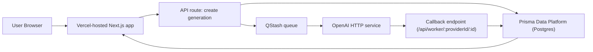

# Sourceful Take Home Project

* Original brief
* [Planning Documentation](./PLANNING.md)

## App Screenshots


### QStash Local Mode


## Architecture



## Running Locally
Set your Node version — I'm using [mise](https://mise.jdx.dev).
See `mise.local.toml` and use this version if you're using a different version manager (e.g. nvm)

```sh
# Dependencies
pnpm i
docker compose up -d        # start db
pnpm mock-openai-service    # Start openai API mock
pnpm qstash dev             # start qstash for local testing

cd apps/imagegen

# Dev services (run separately so you can manage them independently)
pnpm db migrate dev         # migrate dev db
pnpm db studio              # db studio at http://localhost:51212 (optional)
pnpm dev                    # start app

```

### OpenAI Mock vs Real API
By default, local development is set up to use the mock OpenAI HTTP service (`pnpm mock-openai-service`).

To use your own OpenAI API key/provider instead, override these values in your app `.env` file:

```env
OPENAI_API_KEY=your_api_key_here
OPENAI_API_URL=your_provider_base_url_here
```

Example (official OpenAI endpoint):
```env
OPENAI_API_URL=https://api.openai.com/v1
```

### Monitoring & Debugging
* [QStash Local Monitoring & Logs](https://console.upstash.com/qstash/local-mode-user)


## deployment
* DB: [Prisma Data Platform](https://console.prisma.io/cmlxyzpza03z43xfkczx2pebd/cmlxz087m03zj3xfk59ynmhw6/cmlxz087m03zh3xfk4crkq52z/dashboard)
* App: [Vercel](https://vercel.com/rowans-projects-a8b78570/imagegen)
* [Qstash EU Dashboard](https://console.upstash.com/qstash/8b5103dd-0b84-4ef3-ada0-7a43dd86a49f)

```sh
cd apps/imagegen
pnpm vercel deploy --prod  # requires .env.production
pnpm db migrate deploy
```
