# Sourceful Take Home Project


* Production URL: [https://imagegen.rwnx.dev](https://imagegen.rwnx.dev)
    * You should be able to sign up with `*@sourceful.com` email addresses
* [Original brief](./BRIEF.pdf)
* [Planning Documentation](./PLANNING.md)

## Architecture

```mermaid
flowchart TB
    SlashID["👤 Auth(SlashID)"]
    subgraph App["Next.js (Vercel)"]
        frontend["🌐 Frontend"]
        subgraph api["api"]
            create["➕ POST /api/generations"]
            index["🗃️ GET /api/generations"]
            latest["⏰ GET /api/generations/latest"]
            callback["↩️ POST /api/worker/:providerId/:id"]
        end
    end

    DB["Database (postgres)"]
    subgraph qstash["Qstash"]
        QS["Qstash"]
        QSCallback["Qstash Callback"]
        DLQ["Dead-Letter Queue"]
    end

    OAI["🤖 OpenAI HTTP API"]
    frontend <--> SlashID
    frontend --> create
    frontend --> latest
    frontend --> index
    frontend <--> DB
    create --> DB

    create --> QS
    QS --> OAI
    QS --> DLQ
    OAI --> QSCallback
    QSCallback --> callback
    callback --> DB
```



## Running Locally
Set your Node version — I'm using [mise](https://mise.jdx.dev).
See [mise.local.toml](./mise.local.toml) and use this version if you're using a different version manager (e.g. nvm)

```sh
# Dependencies
pnpm i
docker compose up -d        # start db
pnpm mock-openai-service    # Start openai API mock
pnpm qstash dev             # start qstash for local testing

cd apps/imagegen

# Dev services (run separately so you can manage them independently)
pnpm db migrate dev         # migrate dev db
pnpm db studio              # db studio at http://localhost:51212 (optional)
pnpm dev                    # start app

```

### Local Environment config
By default, local development is set up to use the mock OpenAI HTTP service (`pnpm mock-openai-service`).

To use your own OpenAI API key instead, override these values in your app `.env.local` file:

```sh
# Real OpenAI Service
OPENAI_API_URL=https://api.openai.com
OPENAI_API_KEY=your_api_key_here

# We need a vercel blob store for images
BLOB_READ_WRITE_TOKEN="your_api_key_here"
```

### Monitoring & Debugging

* [QStash Local Monitoring & Logs](https://console.upstash.com/qstash/local-mode-user)

## E2E Testing
There's a basic smoke test to test the image generation on a local environment.
See [./tests/e2e/README.md](./tests/e2e/README.md)

## deployment
* DB: [Prisma Data Platform](https://console.prisma.io/cmlxyzpza03z43xfkczx2pebd/cmlxz087m03zj3xfk59ynmhw6/cmlxz087m03zh3xfk4crkq52z/dashboard)
* App: [Vercel](https://vercel.com/rowans-projects-a8b78570/imagegen)
* [Qstash EU Dashboard](https://console.upstash.com/qstash/8b5103dd-0b84-4ef3-ada0-7a43dd86a49f)

```sh
cd apps/imagegen
pnpm vercel deploy --prod  # requires .env.production
pnpm db migrate deploy
```
